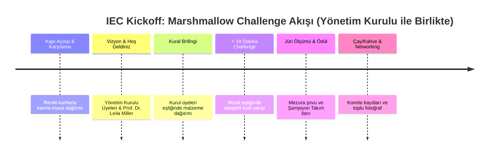

# IEC Grand Kickoff & Icebreaker: The Marshmallow Challenge
## "Build a Tower, Build a Team" — İlk Tanışma & Mühendislik Prototip Turnuvası

**Organizasyon**: IUS Engineering Club (IEC)  
**Organizasyon**: IUS Engineering Club (IEC)  
**Tarih / Saat**: Henüz Belli Değil (TBA / Resmi Onay Sonrası Duyurulacak)  
**Konum**: IUS A-Blok Zemin Kat / Amfi / FENS Maker & Tasarım Alanı  
**Hedef Kitle**: Tüm FENS Mühendislik Öğrencileri (Hazırlık, 1., 2., 3. ve 4. Sınıflar)  
**Format**: Eğlenceli, Rekabetçi, Hızlı Prototipleme & Multidisipliner Takım Mücadelesi  
**Ev Sahibi & Moderatör**: IEC Yönetim Kurulu & Kurucu Ekip (Kurul Üyeleri ile Birlikte)  
**Sosyal Medya & Tanıtım Lideri**: Muhammed Efe Ural (*Social Media & Sponsorship Lead*)  

---

## 1. Etkinlik Vizyonu & Neden Marshmallow Challenge?

Geleneksel öğrenci kulübü tanışma toplantıları genellikle sıkıcı amfi slaytlarından ve tek taraflı monologlardan ibarettir. **IUS Engineering Club**, bu kalıbı ilk dakikadan kırarak mühendislik ruhunu aksiyonla başlatır:

### 🎯 Mühendislik Felsefesi (Agile vs. Waterfall):
* Peter Skillman ve Tom Wujec tarafından geliştirilen ve meşhur TED konuşmasına (*"Build a tower, build a team"*) konu olan **Marshmallow Challenge**, dünya çapında Google, Stanford ve MIT gibi kurumlarda uygulanan efsanevi bir takım dinamiği testidir.
* **MBA vs. Anaokulu Paradoksu**: Araştırmalar, işletme ve yönetim mezunlarının (MBA) 18 dakikanın 15 dakikasını plan yapıp tartışarak geçirdiğini ve son 30 saniyede ağır marshmallow'u tepeye koyduklarında kulenin çöktüğünü göstermektedir. Buna karşılık anaokulu çocukları ilk dakikadan itibaren marshmallow'u tepeye koyup sürekli test ederek (hızlı iterasyon) en yüksek kuleleri diker!
* **Mühendislik Kazanımı**: Katılımcılara teorik laf kalabalığı yerine **hızlı prototipleme (rapid prototyping)**, **üçgen/kafes kiriş statiği (truss structural engineering)**, **stres testi** ve **ekip içi iş bölümünü** kahkahalar eşliğinde öğretir.

### 🤝 Sosyal Kaynaşma & Icebreaker:
* Amfiye giren öğrenciler rastgele renkli kartlarla 4-5 kişilik **karma takımlara** ayrılır (Yazılım, Makine, Elektrik, Endüstri, Boşnak ve Türk öğrenciler karışır).
* 18 dakika boyunca sıfır resmiyetle ortak bir hedefe kilitlenerek buzlar anında erir.

### 📸 Medya & PR Patlaması:
* Yıkılan kuleler, dev mezura ölçümleri ve kahkahalar, **Muhammed Efe Ural** ve **Bakir Bašić** için dinamik Instagram Reels ve tanıtım içerikleri üretir.

---

## 2. Resmi Yarışma Kuralları & Malzeme Kiti

### 📦 Takım Başına Malzeme Çantası (Zarf Kiti):
Her 4-5 kişilik masaya kapalı bir zarf içerisinde eksiksiz verilecek malzemeler:
1. **20 adet** pişmemiş spagetti çubuğu
2. **1 metre (1 yarda)** kağıt maskeleme bandı (masking tape)
3. **1 metre (1 yarda)** pamuk ip / sicim
4. **1 adet** standart boy puf marshmallow
5. **1 adet** kağıt makas (sadece ip/bant kesmek için masaya bırakılır)

### ⚖️ Kurallar:
1. **Süre**: Tam **18 dakika**. Geri sayım sayacı amfi projeksiyonuna yansıtılır ve son 10 saniye tüm salonla birlikte geri sayılır.
2. **Kule Serbest Durmalı (Free-Standing)**: Kule masanın üzerinde tek başına ayakta durmalıdır. Tavana, duvara asılamaz; bir takım üyesi tarafından elle tutulamaz veya masaya bantla yapıştırılamaz.
3. **Marshmallow En Tepede Olmalı**: Marshmallow bütün halinde kulenin en tepe noktasına yerleştirilmelidir. Parçalanamaz, yenemez veya eritilemez.
4. **Malzeme Sınırı**: Verilen 20 spagetti, bant ve ip dışında hiçbir ekstra materyal (kalem, cetvel, telefon) taşıyıcı olarak kullanılamaz.
5. **Ölçüm**: 18 dakika bittiğinde "Eller havaya!" denir. Yıkılmadan ayakta kalan kuleler, masanın yüzeyinden marshmallow'un tepe noktasına kadar mezura ile dikey olarak ölçülür.

---

## 3. Dakika Dakika Etkinlik Programı (Toplam 75 Dakika)

| Zaman Aralığı | Süre | Program Maddesi | Sorumlu | Detay & Sahne Akışı |
| :--- | :---: | :--- | :--- | :--- |
| **00:00 – 00:15** | 15 dk | **Kapı Açılışı & Renkli Kura** | Yönetim Kurulu (Mahmut İhsan, Bekir Enes) | Girişte herkes rastgele renkli yaka kartı çeker; aynı renkteki 4-5 kişi aynı masaya oturur. |
| **00:15 – 00:25** | 10 dk | **IEC Vizyon & Dönem Lansmanı** | Yönetim Kurulu Üyeleri ile Birlikte & Prof. Leila Miller | Kulübün kuruluş vizyonu, DevHack 2027 duyurusu ve Danışman Profesörümüzün selamlama konuşması (Ortak sunum). |
| **00:25 – 00:32** | 7 dk | **Meydan Okuma Başlıyor!** | Yönetim Kurulu Üyeleri | Kuralların eğlenceli sunumu, malzeme çantalarının dağıtımı ve geri sayım hazırlığı. |
| **00:32 – 00:50** | **18 dk** | **⚡ MARSHMALLOW CHALLENGE** | **Yönetim Kurulu & Moderatör Ekip** | Projeksiyonda 18:00 geri sayım, yüksek enerjili müzik, masalar arası canlı denetim ve interaktif destek. |
| **00:50 – 01:05** | 15 dk | **Büyük Ölçüm & Ödül Töreni** | Prof. Leila Miller & Yönetim Kurulu | Resmi şerit metre ile en yüksek kule ölçülür. 1. Takıma "Master Prototyper" ödülü verilir. |
| **01:05 – 01:30** | 25 dk | **Networking, İkram & Kapanış** | Tüm Ekip & Kurul Üyeleri | Müzik eşliğinde serbest sohbet, komite tanıtımları, WhatsApp daveti ve toplu aile fotoğrafı. |

---

## 4. Bütçe & Satın Alma Tablosu (Lean Budget: ~25 KM)

Bu etkinlik, minimum bütçeyle maksimum öğrenci memnuniyeti sağlayan "Lean Event" modelinin mükemmel bir örneğidir:

| Kalem | Miktar | Tahmini Maliyet (KM) | Temin Yeri / Sorumlu |
| :--- | :---: | :---: | :--- |
| **Spagetti (500g)** | 3 Paket | ~6.00 KM | Bingo / Amko Market (Bekir Enes) |
| **Kağıt Maskeleme Bandı** | 3 Rulo | ~6.00 KM | Kırtasiye / OBI (Bekir Enes) |
| **Paket Pamuk İp / Sicim** | 1 Yumak | ~3.00 KM | Kırtasiye (Bekir Enes) |
| **Haribo / Standard Marshmallow** | 2 Paket | ~5.00 KM | Market (Bekir Enes) |
| **Kırtasiye Zarfları & Renkli Kartlar**| 1 Paket | ~4.00 KM | Kırtasiye (Bekir Enes) |
| **Çelik Şerit Metre (Ölçüm)** | 1 Adet | 0.00 KM *(Mevcut)* | FENS Laboratuvarı / Şahsi |
| **TOPLAM BÜTÇE** | — | **~24.00 KM** | *Tier 2 / Tier 3 Bütçesinden rahatça karşılanır.* |

---

## 5. Ekip İçi Görev Dağılımı & Kurul Sinerjisi

* 🤝 **Yönetim Kurulu & Kurucu Ekip (Kolektif Yönetim)**:
  * Etkinliğin genel ev sahipliği ve moderasyonu Kurul üyeleri ile birlikte yürütülür; hiçbir kişi tek başına öne çıkmaz, birliktelik ve takım ruhu yansıtılır.
  * Açılış konuşması ve kulüp vizyonu Prof. Dr. Leila Miller ile birlikte sahneden ortaklaşa aktarılır.
* 📋 **Mahmut İhsan Avcı (Kurucu Ortak & Sekreter)**:
  * Girişte katılımcıların isim ve öğrenci numaralarını teyit etme.
  * Masalara malzeme zarflarını dağıtma, kuralları anlatma ve kronometre yönetimi.
* 🎨 **Muhammed Efe Ural (Social Media & Corporate Sponsorship Lead)**:
  * Resmi etkinlik afişini tasarlama ("The Marshmallow Challenge" tanıtım görselleri).
  * Açılacak Instagram hesabı için geri sayım içeriklerini hazırlama.
  * Etkinlik için kafelerden/şirketlerden sembolik ikram ve çikolata/içecek desteği arayışı (Sponsorluk).
* 📣 **Bakir Bašić (PR & External Media Lead)**:
  * Afişlerin kampüste fiziki dağıtımı ve panolara asılması.
  * 18 dakikalık yarışma anlarını telefonla video kaydına alma; kulelerin yıkılma ve ayakta kalma anlarını yakalama.
* 💰 **Bekir Enes Çokbekler (Sayman & Finans Lideri)**:
  * Market alışverişini yapıp zarfları hazırlama.
  * Kazanan 1. takıma takdim edilecek sembolik hediye/ödülü hazırlama.
* 🎓 **Prof. Dr. Leila Miller (Akademik Danışman)**:
  * Onur jürisi olarak yer alma; hem kule yüksekliğini onaylama hem de "En Estetik Mühendislik Mimarisi" özel ödülünü seçme.

---

## 6. Ödül Kategorileri & Rozetler

Etkinlik sonunda yalnızca bir takımı değil, farklı mühendislik yaklaşımlarını ödüllendirerek herkesin motivasyonu artırılır:
1. 🏆 **Apex Structural Award (Şampiyon Kule)**: Zeminden en yüksek serbest duran kuleyi yapan takım.
2. 📐 **Best Architectural Innovation (En Yenilikçi Tasarım)**: Yıkılsa bile en yaratıcı üçgen/geometrik yapıyı deneyen cesur takım.
3. 💥 **Epic Crash Award (En Dramatik Çöküş)**: Son 5 saniyede marshmallow ağırlığı altında en spektaküler şekilde yıkılan takım (Mühendislikte başarısızlıktan öğrenme ödülü!).
