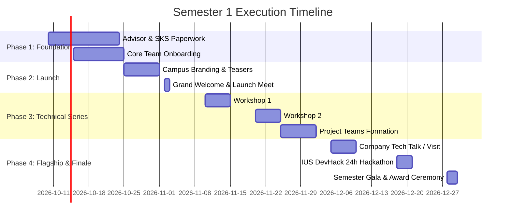

# Semester 1 Operational Action Plan & Timeline

This roadmap outlines the week-by-week timeline from founding to the semester finale for the IUS Engineering Club.

---

---

## Detailed Weekly Breakdown

### Weeks 1–2: Formal Recognition & Academic Anchorage
* **Task 1.1**: Finalize the list of founding members (Captain + Core 3–4 members).
* **Task 1.2**: Approach prospective Faculty Advisors in FENS (e.g. from CS, SE, or EE departments) with the formal invitation letter.
* **Task 1.3**: Submit official registration package to IUS Student Affairs Office (SKS).
* **Task 1.4**: Establish digital infrastructure:
  * Official Email / Google Workspace
  * Linktree / Instagram (`@ius.engineeringevents`) / LinkedIn Page
  * Official WhatsApp Community Group for all engineering students

### Weeks 3–4: Campus Buzz & Grand Kickoff Launch
* **Task 2.1**: Launch visual campaign: Post high-aesthetic posters across FENS A-Block and student cafeterias.
* **Task 2.2**: Open online membership registration form.
* **Task 2.3**: **Grand Welcome Meeting: The Marshmallow Challenge Edition** ([Detailed Blueprint](roadmap/MARSHMALLOW_CHALLENGE_KICKOFF.md)):
  * **Location**: IUS Main Amphitheater (A-Block) / FENS Common Area.
  * **Hosts & Moderators**: Hasan Kaan (*President*) & Muhammed Efe Ural (*Social Life & Fun Engineering Lead*).
  * **Agenda**:
    1. Short Club Vision & Semester Roadmap Intro (Hasan Kaan).
    2. Welcome remarks by Academic Advisor (Prof. Dr. Leila Miller).
    3. **⚡ 18-Minute Marshmallow Challenge Tournament**: 4-5 student multidisciplinary teams building free-standing towers out of 20 spaghetti sticks, 1m tape, 1m string, and 1 marshmallow.
    4. Tower measurements, award ceremony (*Apex Tower*, *Best Architecture*, *Epic Crash*).
    5. Networking, coffee & committee member recruitment.

### Weeks 5–6: First Technical Deep-Dive Series
* **Workshop 1 (Software & AI)**: "Building Autonomous AI Agents & Modern Web Systems" (Hands-on coding lab).
* **Activity**: Form study circles and announce multidisciplinary project interest tracks.

### Weeks 7–8: Multidisciplinary Engineering & Maker Sprint
* **Workshop 2 (Hardware/EE/ME)**: "Microcontroller Prototyping & Sensor Fusion with ESP32" (FENS Electronics/Maker Lab).
* **Project Sprint**: Finalize rosters for IUS student teams preparing semester showcase prototypes.

### Weeks 9–10: Industry Bridge & Company Collaboration
* **Corporate Connect**: Host a senior engineering lead or CTO from a top tech company in Sarajevo (e.g. Symphony, Virgin Pulse, HTEC Group, Ministry of Programming).
* **Company Visit / Office Tour**: Exclusive field trip for active club members to a local technology headquarters.

### Weeks 11–12: The Grand Finale — 24-Hour Hackathon
* **Flagship Event**: **"IUS DevHack 2026"**
  * Duration: 24 continuous hours in IUS campus or hybrid.
  * Themes: AI for Sustainability, Smart Campus Solutions, Hardware-Software Integration.
  * Jury: IUS professors + Industry sponsor judges.
  * Awards: Cash prizes, internships, and sponsor tech gear.
* **Semester Closing**: Wrap-up report to Dean's Office & SKS, financial reconciliation, certificate distribution for active volunteers.
